<picture>
  <source media="(prefers-color-scheme: dark)" srcset="./assets/header-dark.svg">
  <source media="(prefers-color-scheme: light)" srcset="./assets/header-light.svg">
  
</picture>

  <strong>Clinician-scientist advancing AI for Science and biomedical knowledge discovery in systems and translational medicine.</strong>

  Zhengzhou University &nbsp;·&nbsp; Cardiovascular Medicine &nbsp;·&nbsp; Computational Biomedicine

  <a href="https://drgezhang.com/"><strong>Academic Website</strong></a>
  &nbsp;·&nbsp;
  <a href="https://scholar.google.com.hk/citations?user=dNAcSlMAAAAJ&amp;hl=zh-CN">Google Scholar</a>
  &nbsp;·&nbsp;
  <a href="https://orcid.org/0000-0002-3116-3246">ORCID</a>
  &nbsp;·&nbsp;
  <a href="https://www.researchgate.net/profile/Ge-Zhang-42/research">ResearchGate</a>

---

## Scientific Focus

My research integrates explainable AI, multimodal clinical data, multi-omics, computational inference, and mechanistic interrogation to decode complex chronic diseases. Particular interests include cardiovascular and atherosclerotic disease, vascular smooth muscle cell plasticity, circadian disruption, disease heterogeneity, and mechanism-guided translational discovery.

## Research Architecture

<table>
  <tr>
    <td width="50%" valign="top">
      01 · CLINICAL INTELLIGENCE  
      <strong>AI for Science &amp; Multimodal Clinical Intelligence</strong>  
      Developing interpretable computational frameworks for population-scale clinical modeling, risk stratification, and biomedical discovery.
    </td>
    <td width="50%" valign="top">
      02 · VASCULAR SYSTEMS  
      <strong>Atherosclerosis &amp; Vascular Systems Biology</strong>  
      Decoding plaque vulnerability, vascular microenvironment, smooth muscle cell plasticity, and cross-scale vascular remodeling.
    </td>
  </tr>
  <tr>
    <td width="50%" valign="top">
      03 · CROSS-SCALE OMICS  
      <strong>Multi-omics &amp; Translational Discovery</strong>  
      Integrating transcriptomic, proteomic, metabolomic, and single-cell information to resolve disease heterogeneity and prioritize mechanistic drivers.
    </td>
    <td width="50%" valign="top">
      04 · TEMPORAL BIOLOGY  
      <strong>Circadian Disruption &amp; Disease Biology</strong>  
      Investigating circadian dysregulation as a systems-level biological state linking molecular perturbation, vascular dysfunction, and disease progression.
    </td>
  </tr>
</table>

## Selected Research

| Project | Scientific domain | Core contribution | Resource |
|:--|:--|:--|:--|
| **AIHFLevel** | Clinical AI · Heart failure | Interpretable survival assessment integrating multicenter clinical data, individual risk explanation, and prognostic stratification. | [Repository](https://github.com/DrZoggg/AIHFLevel) |
| **APVS** | Atherosclerosis · Plaque biology | Quantification of plaque vulnerability with clinically and biologically interpretable resolution across bulk and single-cell evidence. | [Repository](https://github.com/DrZoggg/APVS) |
| **ClockProCRC** | Circadian systems biology · Cancer | Multi-cohort and single-cell inference of circadian misalignment, molecular drivers, and epithelial clock biomarkers in colorectal cancer. | [Repository](https://github.com/DrZoggg/ClockProCRC) |
| **KIF13B in Atherosclerosis** | Vascular biology · VSMC fate | Cross-scale interrogation of the KIF13B–KCTD10–KLF4 axis linking smooth muscle cell state transitions to plaque stability. | [Repository](https://github.com/DrZoggg/KIF13B-in-Atherosclerosis) |
| **LDL** | Atherosclerosis · State transitions | Public analysis resource spanning lesion-stage transition signals, self-organizing maps, and high-resolution co-expression networks. | [Repository](https://github.com/DrZoggg/LDL) |

## Selected Publications

1. **[AI hybrid survival assessment for advanced heart failure patients with renal dysfunction](https://doi.org/10.1038/s41467-024-50415-9)**  
   *Nature Communications* · 2024

2. **[Vascular smooth muscle cell-derived KIF13B inhibits proinflammatory responses to protect against atherosclerosis](https://doi.org/10.1172/jci194175)**  
   *Journal of Clinical Investigation* · 2026

3. **[System biology analysis reveals circadian rhythm disorder associated with development and progression in colorectal cancer](https://doi.org/10.1038/s41698-026-01699-1)**  
   *npj Precision Oncology* · 2026

4. **[Atherosclerotic plaque vulnerability quantification system for clinical and biological interpretability](https://doi.org/10.1016/j.isci.2023.107587)**  
   *iScience* · 2023

5. **[Smooth muscle cell fate decisions decipher a high-resolution heterogeneity within atherosclerosis molecular subtypes](https://doi.org/10.1186/s12967-022-03795-9)**  
   *Journal of Translational Medicine* · 2022

6. **[Plasma Olink Proteomics Reveals Novel Biomarkers for Prediction and Diagnosis in Dilated Cardiomyopathy with Heart Failure](https://doi.org/10.1021/acs.jproteome.4c00522)**  
   *Journal of Proteome Research* · 2024

Explore the complete, maintained record on the <a href="https://drgezhang.com/publications.html">Academic Website</a> or <a href="https://scholar.google.com.hk/citations?user=dNAcSlMAAAAJ&amp;hl=zh-CN">Google Scholar</a>.

## Research Ecosystem

These resources form one scientific program rather than a set of isolated repositories: clinical phenotypes define the problem, cross-scale omics resolve heterogeneity, computational inference prioritizes states and drivers, and mechanistic investigation carries them toward translation.

- **Clinical Intelligence** — [AIHFLevel](https://github.com/DrZoggg/AIHFLevel) connects longitudinal clinical data with interpretable, individualized risk assessment.
- **Vascular Systems Biology** — [APVS](https://github.com/DrZoggg/APVS), [KIF13B in Atherosclerosis](https://github.com/DrZoggg/KIF13B-in-Atherosclerosis), and [LDL](https://github.com/DrZoggg/LDL) trace plaque vulnerability, cell-state plasticity, and disease transitions across scales.
- **Circadian Computing** — [ClockProCRC](https://github.com/DrZoggg/ClockProCRC) treats temporal dysregulation as a quantifiable systems state linked to disease progression.
- **Multi-omics Discovery** — Transcriptomic, proteomic, metabolomic, and single-cell evidence converge on mechanisms and biomarker candidates across the program.

## Connect

For the full research record, publication-level resources, and current scientific program, visit **[drgezhang.com](https://drgezhang.com/)**. Persistent identity: **[ORCID 0000-0002-3116-3246](https://orcid.org/0000-0002-3116-3246)**.

<picture>
  <source media="(prefers-color-scheme: dark)" srcset="./assets/footer-dark.svg">
  <source media="(prefers-color-scheme: light)" srcset="./assets/footer-light.svg">
  
</picture>
